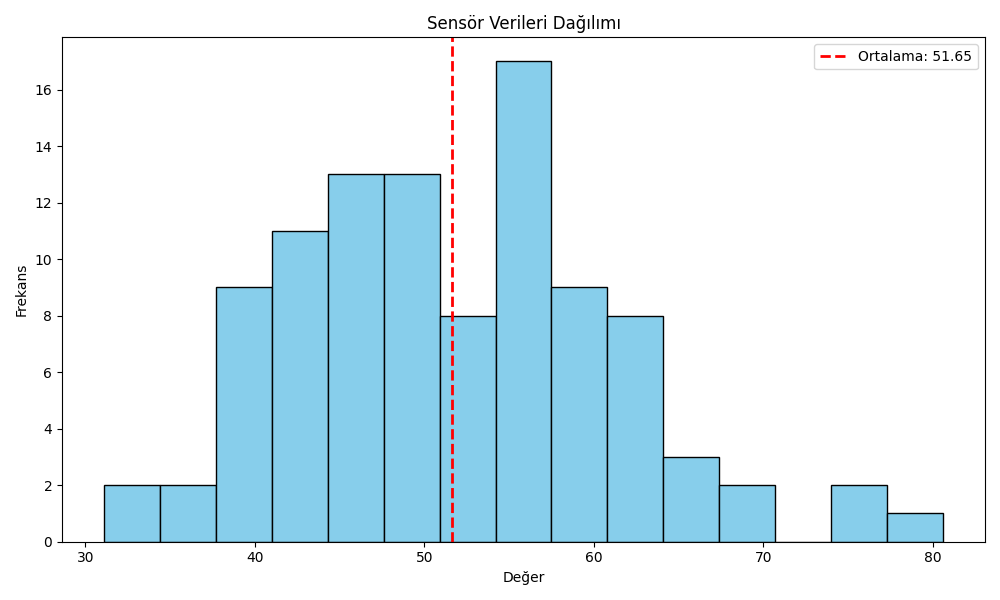

# Week 01 - Sensör Verisi Analizi

Bu haftaki amaç, Python ile temel veri işleme ve görselleştirme yeteneklerini geliştirmekti.

## 📌 Kullanılan Araçlar
- NumPy
- Pandas
- Matplotlib

## 📊 Proje Özeti

- 100 adet rastgele sensör değeri üretildi
- Ortalama ve standart sapma hesaplandı
- Histogram ile veri dağılımı görselleştirildi

## 📷 Örnek Çıktı

